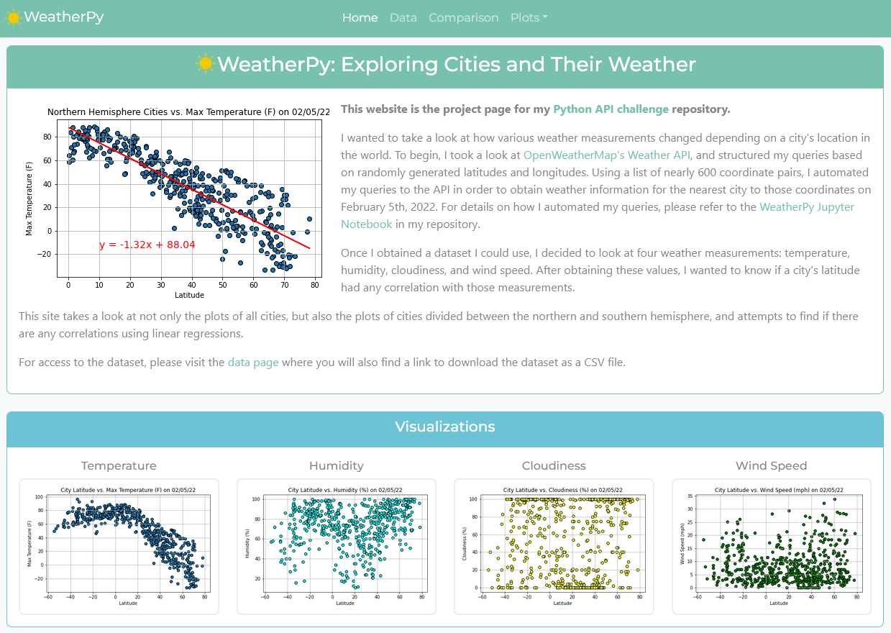
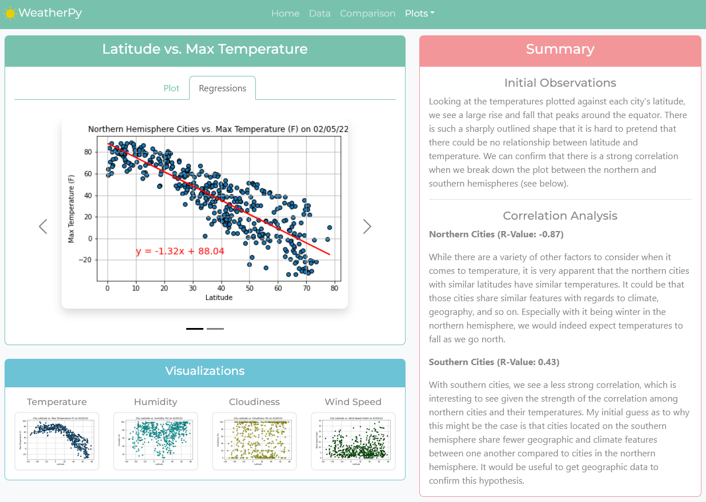
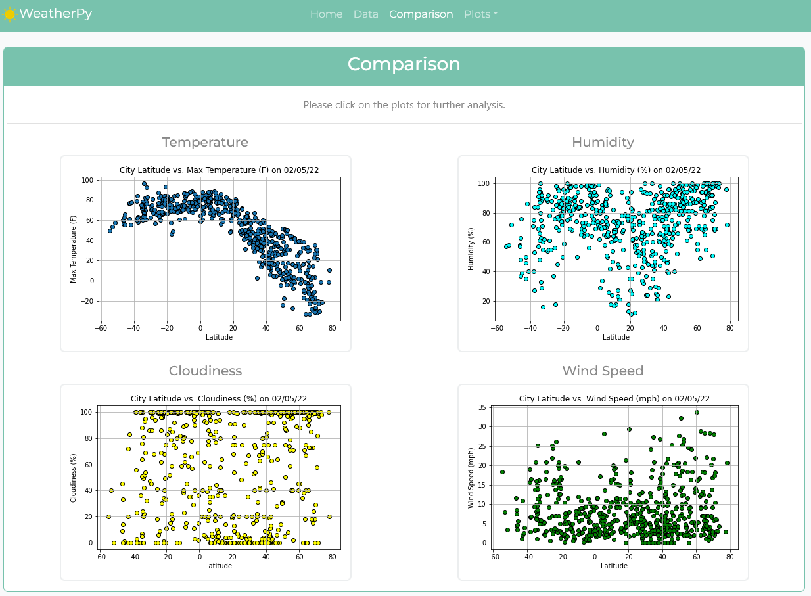
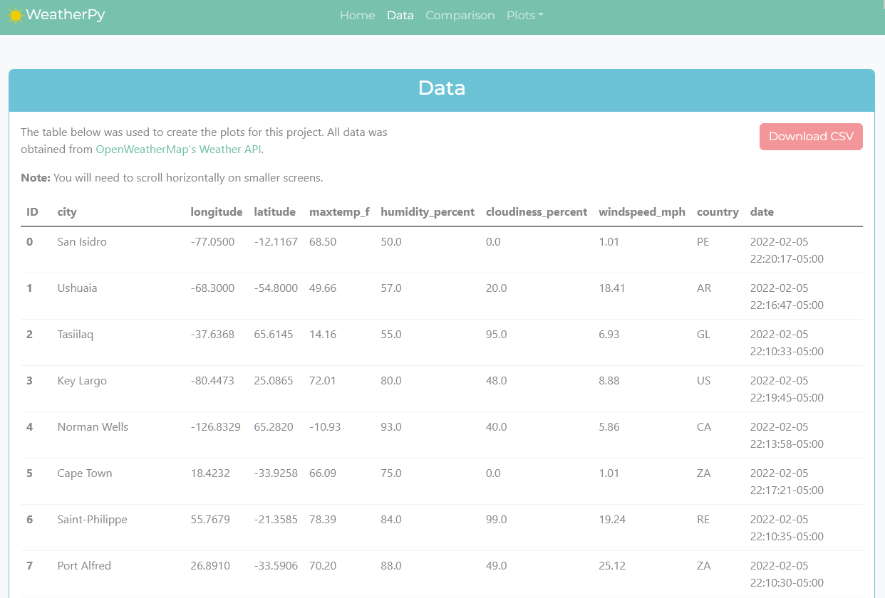
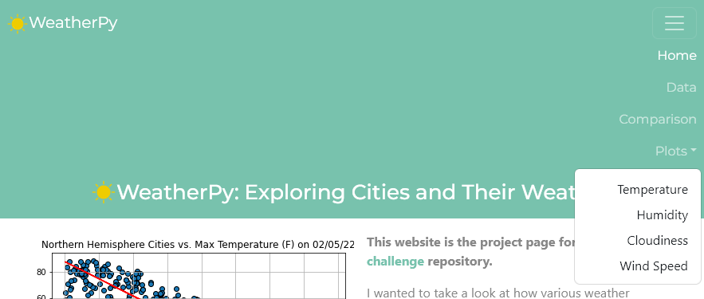

# Web-Design-Challenge: Charles Phil Week 11 Homework

## A few quick notes

With regards to building this project page for my [Python-api-challenge](https://github.com/charlesphil/python-api-challenge) homework, it was extremely difficult to know where to stop. To be honest, there were plenty of features that I would like to have added to the website. Additionally, I left out the VacationPy bonus section for the sake of completing the homework.

## Landing page

The landing page required:

* "An explanation of the project."
  
* "Links to each visualizations page" (as a clickable image in a sidebar).

I opted to make my clickable images into a bar that ran across the bottom of the page. When viewing the home page on smaller screens, the bottom visualization card becomes a stack of 2x2 images.

## Four visualization pages

The visualization pages required:

* "A descriptive title and heading tag."
  
* "Links to each visualizations page" (as a clickable image in a sidebar)

* "A paragraph describing the plot and its significance."

I included the required title and headings, and retained the visualization card as a bottom bar instead of a sidebar. The paragraphs describing the plot and its significance were put into a separate card to the side of the plot for easy reference. When the screen gets smaller, the summary card disappears and instead the text appears in the same card body as the plot. I also included my regressions as a separate tab inside of the plot card, and appears as a carousel to flip between the two regression plots for each weather measurement. The layout is identical for all four pages.

## Comparison page

The comparison page required:

* "All of the visualizations on the same page so we can easily visually compare them."
  
* "Uses a Bootstrap grid for the visualizations."
  * "The grid must be two visualizations across on screens medium and larger, and 1 across on extra-small and small screens."

The comparison page was finished as required.

## Data page

The data page required:

* "Displays a responsive table containing the data used in the visualizations."
  * "The table must be a bootstrap table component."
  * "The data must come from exporting the .csv file as HTML, or converting it to HTML. Try using a tool you already know, pandas. Pandas has a nifty method appropriately called to_html that allows you to generate a HTML table from a pandas dataframe."

I used Pandas to generate the HTML layout from my WeatherPy Jupyter Notebook. I then implemented the table with Bootstrap, including hover functionality and the ability to download the dataset as a CSV file.

## Navigation bar

The navigation bar took me an obscene amount of time to get the way I wanted it. I opted to center the nav bar items instead of moving the links to the right. However, the requirements only specified that I had to have the name of the website on the "left", and the other menu items on the "right of the navbar." I opted to interpret that a bit more liberally in order to continue with my visual style of keeping important headers and text centered on the page.

Additionally, when the navbar is collapsed due to media queries (which occurs at screen sizes medium and smaller), I switch to a vertical right alignment, to make it easy to reach navigation items right after the user clicks on the hamburger menu. I opted to have the dropdown overlap the content using a z-index. Without it, the dropdown menu nearly doubles the size of the nav bar, creating wasted space.

This website will be deployed to the Github Page for my Python-api-challenge repository hosted at <https://charlesphil.github.io/python-api-challenge>.
